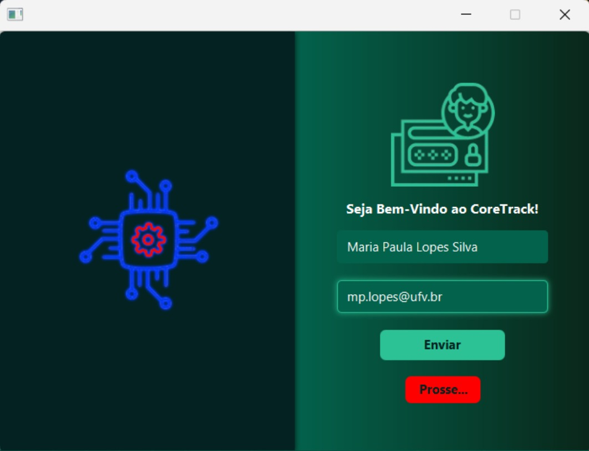
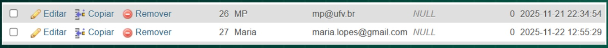
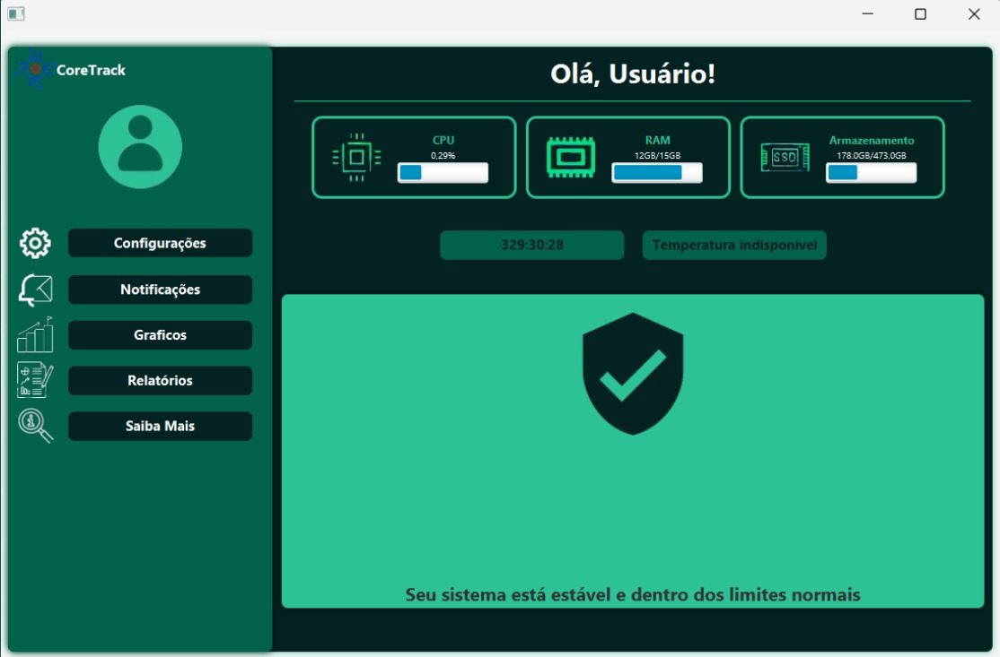
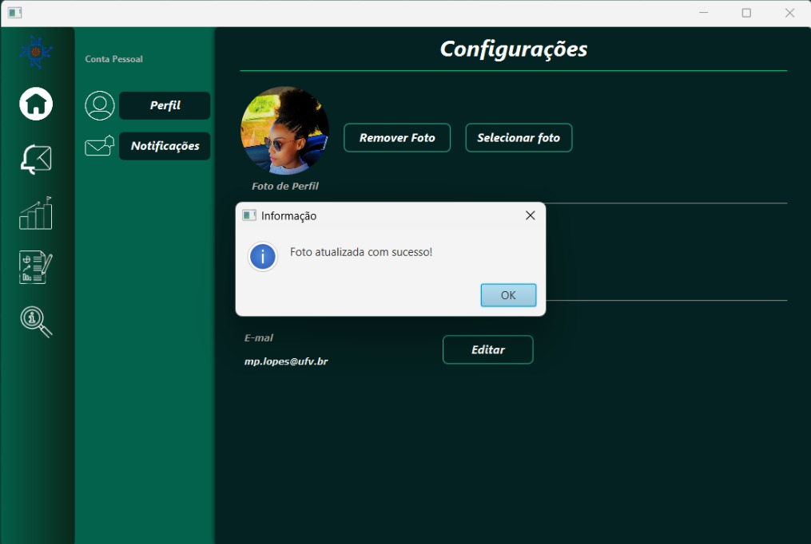
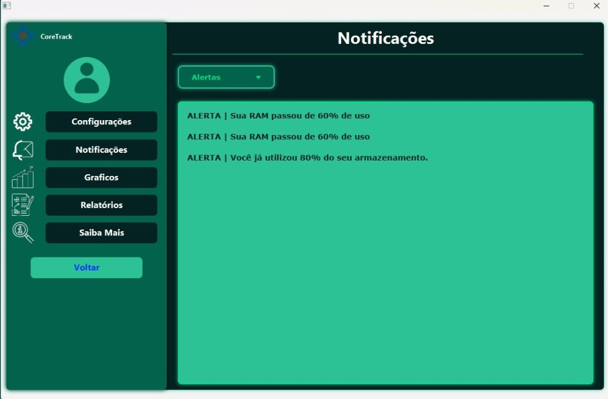
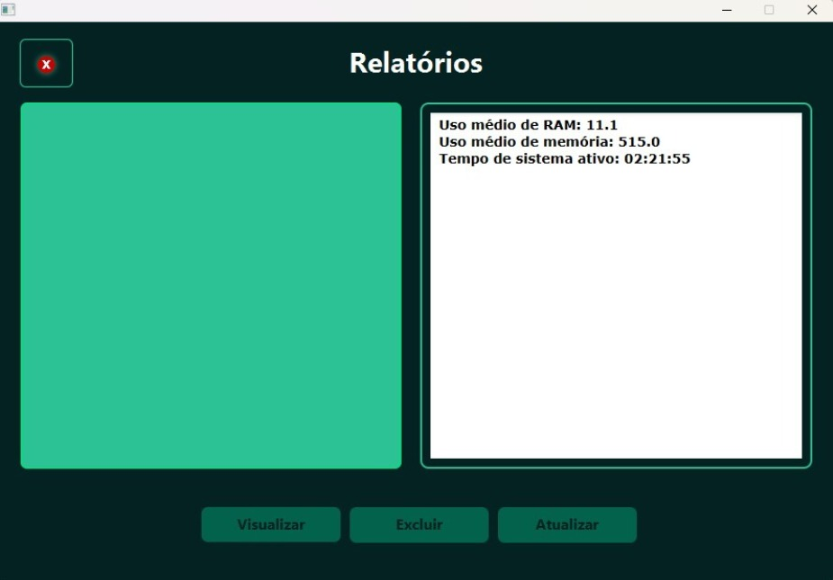

# 🖥️ CoreTrack

Sistema de monitoramento de desempenho de computadores desenvolvido como Trabalho de Conclusão de Curso (TCC) do curso Técnico em Informática.

---

## 📌 Visão Geral

O CoreTrack é uma aplicação desktop que permite acompanhar, em tempo real, o uso de recursos do computador de forma simples e acessível, mesmo para usuários sem conhecimento técnico.

A proposta do sistema é transformar informações técnicas em dados compreensíveis, auxiliando na identificação de problemas e na otimização do desempenho da máquina.

---

## 🎯 Objetivo

Desenvolver uma solução intuitiva e funcional para:

- Monitorar o desempenho do computador  
- Identificar gargalos e problemas  
- Sugerir melhorias práticas ao usuário  

---

## ⚙️ Funcionalidades

- Monitoramento em tempo real:
  - CPU  
  - Memória RAM  
  - Armazenamento  
  - Temperatura  
  - Tempo de uso  

- 🔔 Sistema de notificações:
  - Alertas críticos  
  - Informações  
  - Sugestões  

- 🧹 Limpeza de arquivos temporários  
- ❌ Encerramento de processos em segundo plano  
- 👤 Gerenciamento de usuário (nome, e-mail e imagem)  
- 📊 Visualização de dados do sistema  

---

## 🛠️ Tecnologias Utilizadas

- ☕ Java  
- 🖼️ JavaFX  
- 🎨 CSS  
- 🗄️ SQL  
- ⚙️ OSHI (monitoramento de hardware)  
- 📐 UML (modelagem do sistema)  

---

## 🧠 Abordagem do Projeto

Diferente de ferramentas tradicionais, o CoreTrack foi desenvolvido com foco em:

- Simplicidade de uso  
- Interface intuitiva  
- Redução da complexidade técnica  
- Melhor experiência do usuário  

---

## 📁 Estrutura do Projeto

A pasta `src` está organizada da seguinte forma:

- 📂 BancoSql → Scripts e configurações relacionadas ao banco de dados  
- 📂 Classes → Classes principais do sistema  
- 📂 Conexao → Conexão com o banco de dados  
- 📂 Controllers → Controle da lógica entre interface e dados  
- 📂 coretrackapp → Classe principal da aplicação  
- 📂 Css → Estilização da interface  
- 📂 DAOs → Acesso e manipulação de dados no banco  
- 📂 Fxml → Estrutura das telas (interface gráfica)  
- 📂 imagens → Recursos visuais do sistema  
- 📂 libs → Bibliotecas externas utilizadas  
- 📂 Runnables → Execução de processos do sistema  
- 📂 Utilitarios → Funções auxiliares e reutilizáveis

---

## ▶️ Como Executar

> ⚠️ Este projeto requer configuração de ambiente.

### 📌 Pré-requisitos

- ☕ Java (JDK 8 ou superior)
- 🛠️ IDE Java:
  - NetBeans (recomendado)
  - IntelliJ ou Eclipse
- 🗄️ MySQL
- 📦 XAMPP (ou similar)

---

### ⚙️ Passo a passo

1. Baixe o projeto:
- Clique em **Code → Download ZIP** no GitHub  
- Extraia a pasta no seu computador  
- (ou clone via Git, se preferir)

2. Inicie o banco de dados:
- Abra o XAMPP  
- Inicie o serviço **MySQL**

3. Crie e configure o banco:
- Abra o **phpMyAdmin** (http://localhost/phpmyadmin)  
- Crie um banco de dados (ex: `coretrack`)  
- Importe o arquivo: `/src/BancoSql/coretrack.sql`

4. Configure a conexão:
- Acesse a pasta `Conexao` no projeto  
- Ajuste:
  - usuário (ex: `root`)  
  - senha (geralmente vazia no XAMPP)  
  - porta (padrão: 3306)

5. Abra o projeto na IDE:
- Abra a pasta do projeto no **NetBeans** (recomendado)  
- Aguarde a indexação das dependências  

6. Execute o sistema:
- Localize a classe principal (`coretrackapp`)  
- Execute o projeto  

---

### ⚠️ Observações

- O arquivo `config_usuario.txt` é necessário para o funcionamento  
- Algumas funcionalidades (como gráficos e relatórios) podem não estar totalmente implementadas  
- Caso haja erro de conexão, revise as configurações do banco

---

## 📷 Imagens do Sistema

### 🖥️ Tela Dados

### 💾 Dados Salvos

### 📊 Tela de Monitoramento

### ⚙️ Configurações

### 🔔 Notificações

### 📑 Relatórios
.

---

## 👩‍💻 Autora

**Maria Paula Lopes Silva**  
Técnica em Informática — CEDAF / UFV  

🔗 GitHub:  
https://github.com/maria-paula-lopes-dev  

💼 LinkedIn:  
https://www.linkedin.com/in/maria-paula-lopes/
